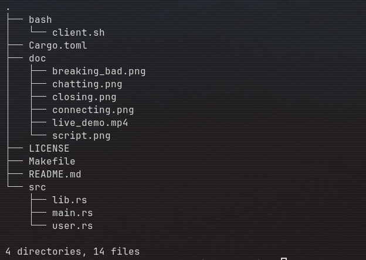
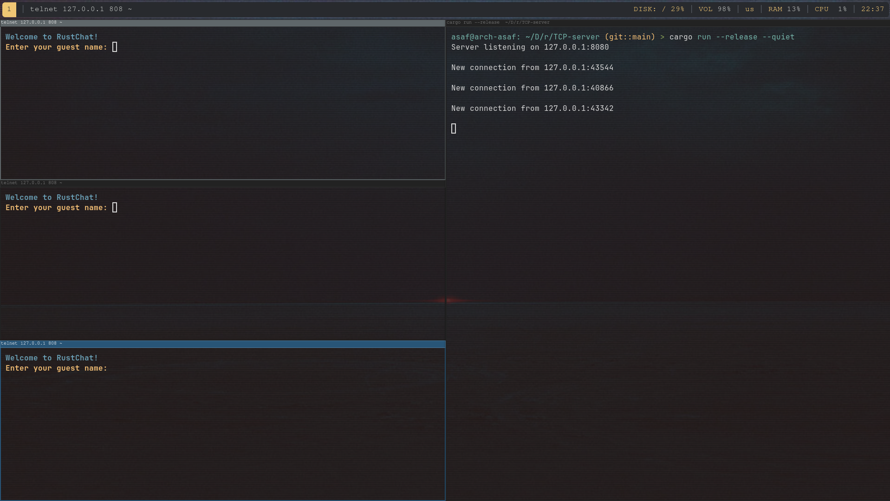
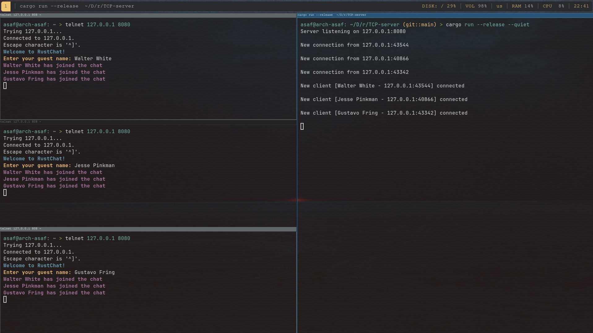
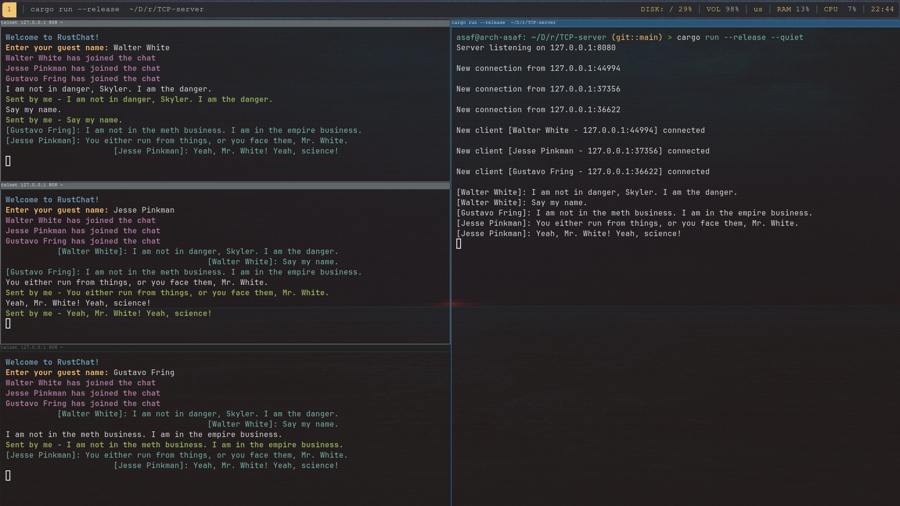
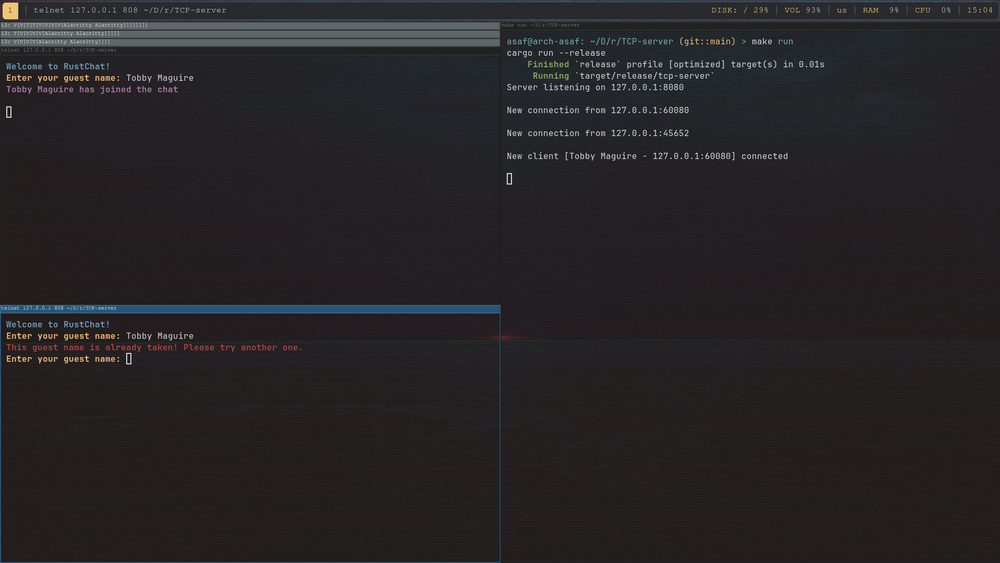
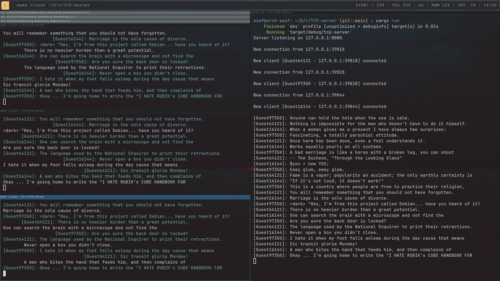

# rs-chat

<br>

<p align="center">
  
</p>

<br>

<p align="center">
A TCP chat server built in Rust using <a href="https://tokio.rs/">tokio</a> for asynchronous handling and broadcast channels for message distribution. This project was created to explore Rust's async capabilities and see what the language has to offer for concurrent network programming.
</p>

<br>


## Features

<br>

This chat server handles multiple connections smoothly using tokio's async capabilities. When you send a message, it broadcasts to everyone except you. The client script automatically generates random guest names for users.

The client script is rather helpful for testing the functionality of the API - it detects your Unix package manager and can install missing dependencies like [telnet](https://en.wikipedia.org/wiki/Telnet) and [fortune-mod](https://github.com/shlomif/fortune-mod) with your permission. 

The server keeps track of active usernames to prevent duplicates, so you'll get notified if someone's already using the name you want.

Everything's built around a simple [Makefile](https://www.gnu.org/software/make/manual/make.html) system that makes development and deployment straightforward.

<br>


## Project Structure

<br>

<p align="center">
  
</p>

<br>


## Getting Started

<br>

### Available Make Commands

<br>

The project includes a comprehensive Makefile with the following commands:

```bash
make run      # Run the project in --release mode
make client   # Run the demo client script  
make build    # Build the project in --release mode
make test     # Run all unit and integration tests
make fmt      # Format the code using rustfmt
make clean    # Remove the target directory
make help     # Show available commands
```

<br>


### Running the Server

<br>

Start the server using the Makefile:

```bash
make run
```

The server will start on `127.0.0.1:8080` and begin listening for connections.

<br>

### Connecting Clients

<br>

#### Using the Automated Client Script

<br>

The easiest way to connect is using the provided client script:

```bash
make client
```

This script:
- Automatically detects your Unix package manager (apt, yum, brew, pacman, etc.)
- Installs required dependencies (telnet and fortune-mod) with your permission
- Connects to `127.0.0.1:8080` via telnet
- Generates a random guest name (Guest10000 through Guest99999)
- Handles the connection process seamlessly

<br>

#### Manual Connection with Telnet

<br>

For manual testing, you can connect directly:

```bash
telnet 127.0.0.1 8080
```

<br>


### Testing Multi-Client Chat

<br>

To test the chat functionality:

1. Start the server: `make run`
2. Open multiple terminals
3. In each terminal, run: `make client`
4. Start chatting! Messages from one client will appear in all other connected clients

<br>

## Demo Screenshots

<br>



---


---


---


---



<br>
<br>
                                     
 <p align="center">
  <a href="https://github.com/shlomif/fortune-mod">fortune</a> is a Unix utility that generates random quotes. I used it in my bash script for simplicity :)
</p>


